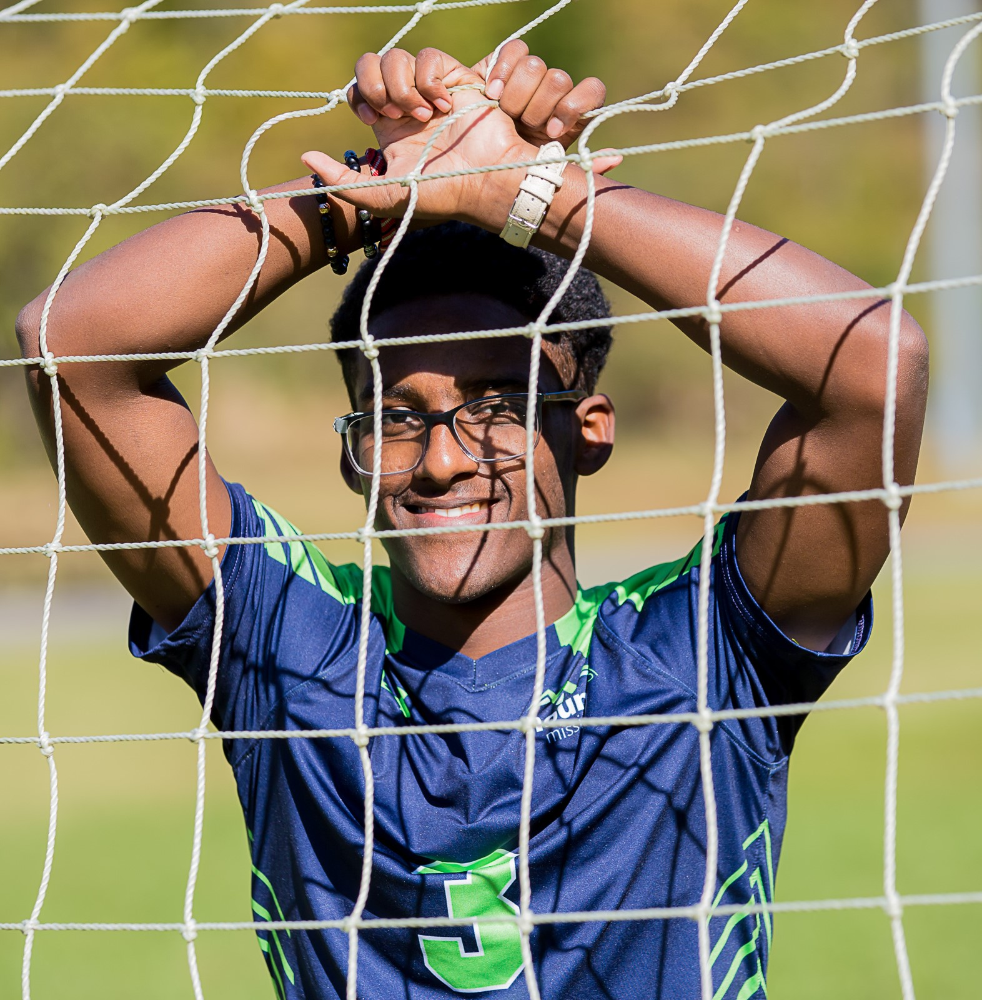

# ABOUT ME:
## A little about myself:
I am currently a sophomore at Quinnipiac University. I major in Computer Science and also minor in Mathematics and Game Design and Development. My favorite languages are Java and Scala. My favorite Computer Science topics are Cybersecurity and game Development. In my free time I enjoy playing the piano and playing pickup soccer.

## why Computer Science:
Growing up I have always had a passion for problem-solving. From taking my toys apart to decipher its secrets to fixing all tech related problems for my family. These small projects lead me to realize my love for creating things through programming. Through writing code, I found a sense of accomplishment in fixing things and making exciting projects form my imagination. I love the idea of creating something amazing with little to no resources that could change the world.

## Interests and Career Goals:
One immediate career goal I would like to achieve is to be an excellent programmer. I want to learn more languages and know more about Cybersecurity. After I graduate, I plan to either start by working for big tech companies like Tesla or Google or pursue a master’s degree in Cybersecurity. After gaining experience in the tech industry, I would like to take what I have learned and create a startup tech company with a group of my friends. On the other hand, If I decide to pursue a master’s degree in Cybersecurity, I would like to work in the government sector to protect our country from cyber-attacks and help ensure privacy and security for the people.

##### Click [here](./index.md) to go back to the homepage! 	:wink:

##### Click [here](./projects.md) to see what projects I have worked on!   :computer:

